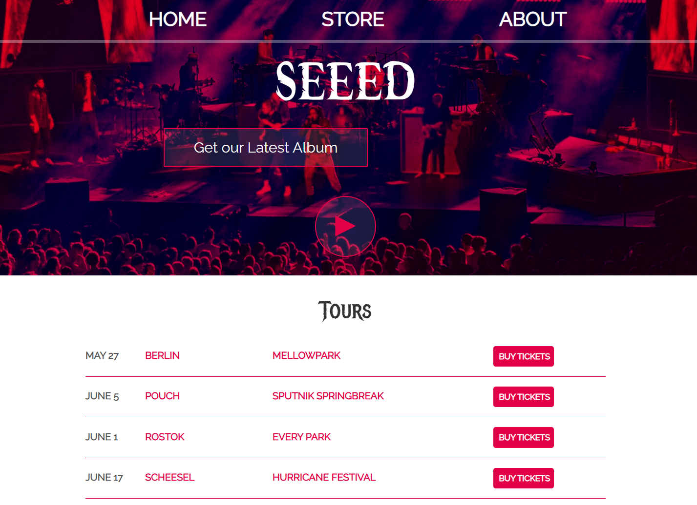
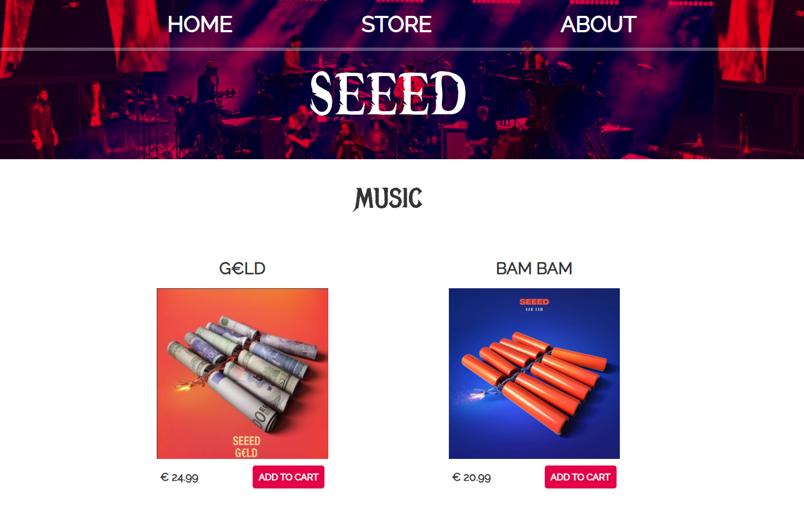
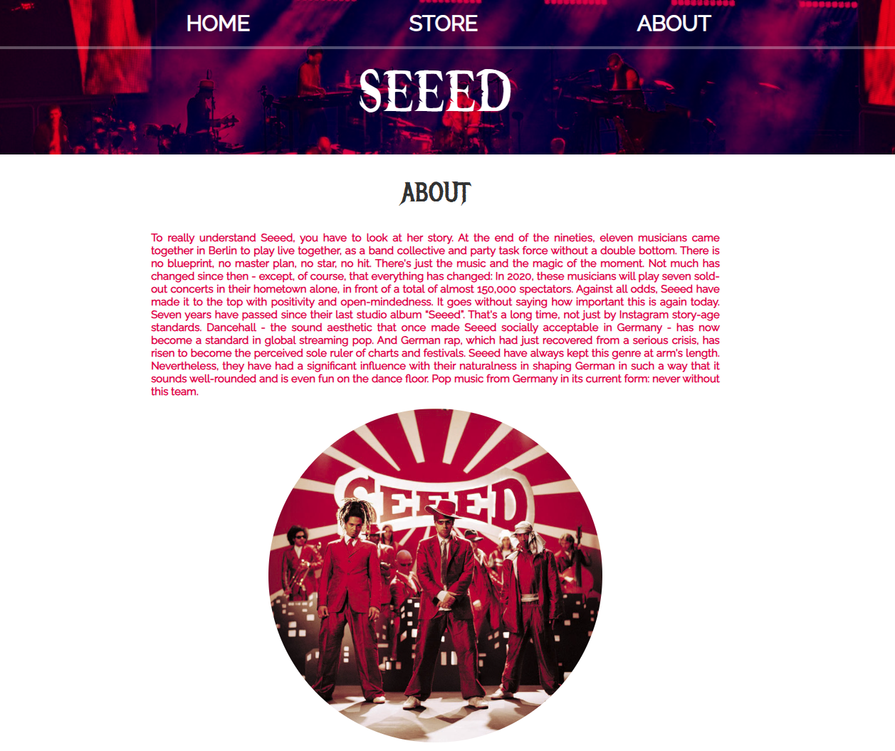

# SEEED Band Website Project

Welcome to the SEEED Band Website — a project created to refresh and strengthen essential web development skills by building a fully functional and visually engaging music band website using HTML, CSS, and vanilla JavaScript.

This site celebrates the Berlin-based music group SEEED, featuring their upcoming tours, an about page describing the band's history, and an interactive store for buying music albums and merchandise.

## 🎯 Project Purpose

The primary goals of this project are:

- **Reinforce Front-End Fundamentals**: Practice and apply HTML5, CSS3, and JavaScript DOM manipulation techniques.
- **Responsive Web Design**: Structure and style a real-world themed website for a music band.
- **Interactive Features**: Implement cart functionality in the store section using JavaScript event handling and DOM updates.
- **Good Code Organization**: Follow best practices for file structuring and linking assets (CSS, JavaScript, images).

This project simulates a simple real-world client request: "Build a mini online presence for a band, including an About page, Store, and Tour information."

## 🧱 Project Structure

```
/SEEED-Website ├── index.html # Home page (Tours) ├── seeed.html # About page (Band history) ├── store.html # Online store (Albums & Merch) ├── styles.css # CSS styling for all pages ├── store.js # JavaScript logic for shopping cart └── Images/ # Image assets (albums, merch, logos, screenshots)
```

## 🚀 How to Run Locally

1. Download or Clone this repository.
2. Make sure all files and folders are intact and linked properly (especially the `/Images` folder).
3. Simply open the `index.html` file in your preferred web browser.
4. Navigate between Home, Store, and About pages using the navigation bar.

**✅ No installations or server setup needed** — it's a pure static website project.

## ✨ Features

- **Responsive homepage** showing upcoming tour dates
- **Detailed About page** with the band's story
- **Online store with**:
  - Add to Cart functionality
  - Dynamic Cart total calculation
  - Quantity adjustment
  - Item removal
  - Purchase confirmation popup
- Styled using custom CSS with a modern, bold visual theme
- Clean, modular JavaScript for DOM manipulation
- Good SEO practices with meta tags

## 📸 Screenshots

- Homepage (Tours)
  

- Store Page (Albums & Merch)
  

- About Page (Band History)
  

## 🧠 What I Learned

- Practical use of the DOM API (querySelector, event listeners, dynamic content updates)
- Structuring and linking multi-page websites
- Styling large layouts with pure CSS
- Handling basic e-commerce logic with JavaScript
- Attention to user experience through simple but intuitive UI design

## 🛠 Tech Stack

| Technology       | Usage                              |
| ---------------- | ---------------------------------- |
| HTML5            | Structure of the website           |
| CSS3             | Styling, layout, responsive design |
| JavaScript (ES6) | Cart logic, DOM interactions       |
| Images & Fonts   | Visual assets, custom fonts        |

## 📜 Credits

- Band information referenced from Seeed Official Website.
- Icons sourced from official YouTube, Spotify, and Facebook logos.
- All development, coding, and design done by Atul Kumar Yadav.

## 📢 Final Words

This project was a fun and educational journey into bringing together structure, style, and interactivity to create a full mini-website! Perfect for anyone looking to brush up their front-end basics.

🎉 Thank you for visiting the SEEED website project! 🎶
